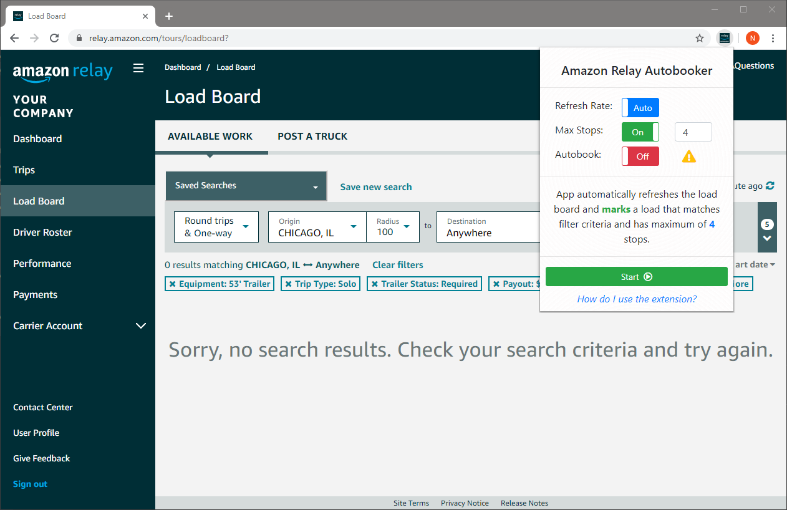
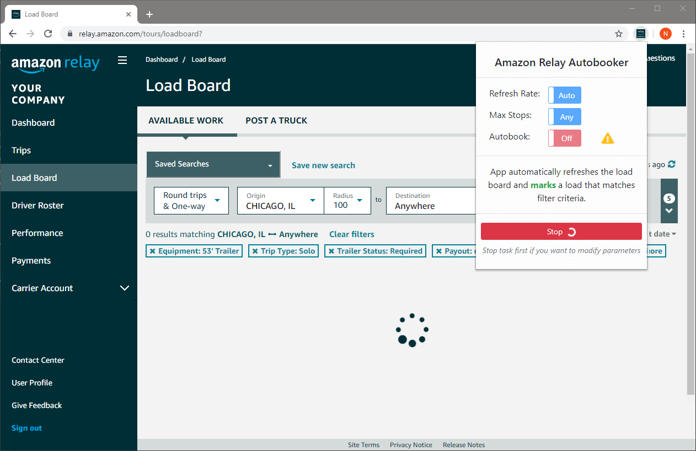
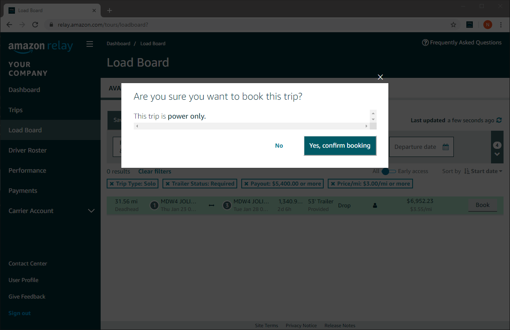

## Amazon Relay Autobooker Chrome Extension Help Page 

### About the Extension

Amazon Relay Autbooker Extension is developed by exprienced developers to simplify the life of truck dispatchers who struggle getting good loads on load board.

### Requirements

1. Must have [Google Chrome](https://www.google.com/chrome/) web browser installed
2. Must have an access to [Amazon Relay](https://www.relay.amazon.com)

### How to install extension
1. Open Chrome web browser and navigate to [Google Webstore](https://chrome.google.com/webstore/detail/amazon-relay-auto-refresh/gooaddljkpdcjbdigogmajlcgifjjhgp)
2. Click on **Buy** button
- If you do not see **Buy** button, you should change the account location to United States

### How to use extension
1. Open Google Chrome web browser.
2. Navigate to [Amazon Relay](https://www.relay.amazon.com) website and login.

3. Click on **Load Board** Link on left navigation area

4. Setup Filters

5. Click on extension icon on browser right top corner

6. If you want to get notified on a new load with specific number of stops, then turn on Maximum stops toggle and enter number of maximum stops

7. If you want to any new load to be booked automatically, then turn on Autobook toggle, but be careful, this option will book any load that matches filter criteria, so you want to make sure to you setup filters.

8. If you want extension to book any new load that matches your filter criteria and has less than defined number of stops, then turn on both toggles and specify maximum number of stops.

9. To start the task, click on start button

10. If you want to cancel, click on Stop button

11. Depending on how you setup the extension parameters, when a new load becomes available in load board, extension either marks it:

Or books it by clicking on book and accept buttons. Extension notifies you with sound as well.

12. Extension stops when a load is found or accepted.
